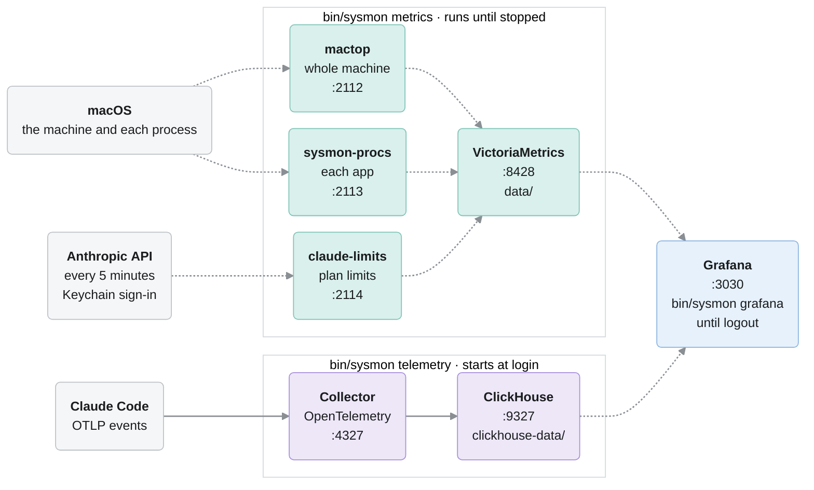

# sysmon

A local monitor for this Mac. [mactop](https://github.com/metaspartan/mactop) samples CPU,
GPU, power, temperatures, memory, network, disk and battery, and exposes them as Prometheus
metrics. `sysmon-procs`, a small collector in `procs/`, measures the same resources for each
app. `claude-limits`, in `claude-limits/`, reads how much of each usage limit of the Claude
plan is used. Single-node [VictoriaMetrics](https://victoriametrics.com) scrapes and stores
all three, and Grafana charts them.

Nix provides all four programs, pinned by `flake.lock`. None is installed system-wide, and
they run only between `bin/sysmon metrics start` and `bin/sysmon metrics stop`. The flake
builds for Apple silicon Macs only, and `bin/sysmon` needs Nix with flakes enabled.

Beside them, an OpenTelemetry collector records Claude Code's telemetry in ClickHouse. Those
two run under launchd and start again at login. Grafana charts both kinds of data and runs
from `bin/sysmon grafana start` until `bin/sysmon grafana stop` or logout. Nix pins these
three as well. See Claude telemetry below.

## How the parts fit together

VictoriaMetrics scrapes the three collectors, and Grafana queries both stores when a
dashboard is open. Claude Code sends its events to the collector, which writes them into
ClickHouse. Every service listens on 127.0.0.1 only.

Arrows point the way data flows. Dashed arrows are pulls, where the receiver asks for the
data. Solid arrows are pushes, where the sender delivers it.

## Use

`bin/sysmon` starts, stops and reports on every service, and run alone it prints its
commands. It is not on PATH, and its help and messages call it `sysmon`.

    bin/sysmon metrics start   # starts mactop and sysmon-procs, waits for their first
                               # samples, then claude-limits and VictoriaMetrics
    bin/sysmon metrics stop    # stops all four and removes their PID files
    bin/sysmon status          # running or not, PIDs, CPU% and RSS of every service, the
                               # health of each scrape target, and the size of the metrics
                               # and telemetry data
    bin/sysmon grafana start   # starts Grafana in the background and opens the dashboards
    bin/sysmon grafana stop    # stops Grafana

A service named without `start` or `stop`, as in `bin/sysmon grafana`, starts.
`bin/sysmon telemetry` is under Claude telemetry below, and `bin/sysmon uninstall` under
Uninstall.

Dashboard: http://localhost:3030/d/mac-system, while Grafana runs. It reads
VictoriaMetrics, so it shows data only while the metrics services run. Hover any chart and
every other chart marks the same moment, which lines up a load spike with the power, heat
and fan speed it caused. For ad hoc queries, VictoriaMetrics has its own UI at
http://127.0.0.1:8428/vmui.

The top of the dashboard is the whole machine. Below it, Top apps now ranks apps by CPU,
memory, network, disk, GPU and energy over the last minute, Apps over time stacks the eight
biggest apps of each against mactop's whole-machine line, and Inside $app splits the app
picked at the top into its processes. Its table lists each process with its CPU, resident
memory, footprint, network, disk, GPU, power, idle wakeups, threads, open files and
sockets, and the charts below it follow each of those per process over time, with
page-ins. Footprint is the memory figure Activity Monitor shows. A blank cell has no
reading behind it. The app picker starts on the app using the most memory.

`grafana/mac-system.py` writes this dashboard's JSON, so change the script rather than the
JSON, then run it:

    nix shell nixpkgs#python3 -c python3 grafana/mac-system.py

Grafana picks up the rewritten file on its own.

An app is the outermost `.app` bundle a process runs from, so Brave's helpers count as
Brave Browser. Processes outside any bundle group by executable name. Its limits:

- WebKit's shared services (`com.apple.WebKit.WebContent`, `com.apple.WebKit.GPU`) sit
  outside Safari's and Mail's bundles, so they show under their own names.
- Footprint, disk, energy, idle wakeups, page-ins, threads, open files and sockets cover
  only this user's processes. macOS does not report them for processes of other users
  without root, so a root process such as WindowServer shows only CPU, resident memory
  and GPU.
- Network counts external interfaces only, as mactop does, so traffic between local
  processes, VictoriaMetrics scraping included, is left out. A process that has held no
  external connection since `bin/sysmon metrics start` has no network reading.
- Byte rates in the Top apps now and Processes now tables round to whole bytes per
  second, because Grafana would otherwise show a fraction of a byte as millibytes.
- Memory is resident memory, which counts shared pages once for each process that maps
  them, so the apps add up to more than the machine's used memory.
- The kernel's own CPU time belongs to no app, which is most of the gap between the apps
  and mactop's whole-machine CPU line.

mactop 2.1.5 reads CPU, DRAM and Neural Engine power and DRAM bandwidth as zero on this
M5 Pro, so the dashboard charts only whole-machine and GPU power, and leaves out the
samples where those readings spike and the occasional impossible network sample.

All four listen on 127.0.0.1 only: mactop on port 2112, sysmon-procs on 2113,
claude-limits on 2114, VictoriaMetrics on 8428.

## Claude plan limits

`claude-limits` reads how much of the Claude plan's five-hour session limit, its weekly
limit, and the weekly limits that cover one model or one surface is used, and when each
resets. It asks every five minutes, from the same endpoint Claude Code's `/usage` reads,
`https://api.anthropic.com/api/oauth/usage`. Anthropic does not document that endpoint, so
it can change or go away without notice. A learning test checks how the collector reads it
against the real endpoint, signed in with this Mac's login:

    cd claude-limits && nix shell nixpkgs#go -c go test -tags learning -run TestUsageAPILearning .

The Plan limits row of the Claude usage dashboard, http://localhost:3030/d/claude-usage,
charts them. It reads VictoriaMetrics, so that row is blank while the metrics services are
stopped. Its even pace line is how much of a limit would be used by now if the whole limit
were spread evenly up to the reset, so use above that line runs out before the reset if it
keeps its average rate so far.

It signs in with the Claude.ai login that Claude Code keeps in the Keychain item
`Claude Code-credentials`, read again before every request, and it never refreshes that
login. That item is in the login Keychain of the user signed in at the Mac, so
`claude-limits` has to run as that user, with that Keychain unlocked as it is after they
sign in. When a read fails, for example because the login expired and Claude Code has not
refreshed it yet, `/metrics` answers 503 until a read succeeds again, five minutes later at
the earliest. VictoriaMetrics then marks the target down, `bin/sysmon status` shows it, the
charts leave a gap rather than repeat an old reading, and `logs/claude-limits.log` says why.

## Claude telemetry

An OpenTelemetry collector stores Claude Code's OpenTelemetry events in ClickHouse, and
Grafana charts them, so token spend can be broken down by model, subagent, skill, MCP
server, repository, session, prompt, and tool. Claude Code exports to it when the `env`
object of `~/.claude/settings.json` holds these entries:

    "CLAUDE_CODE_ENABLE_TELEMETRY": "1",
    "OTEL_LOGS_EXPORTER": "otlp",
    "OTEL_EXPORTER_OTLP_PROTOCOL": "grpc",
    "OTEL_EXPORTER_OTLP_ENDPOINT": "http://localhost:4327",
    "OTEL_LOG_USER_PROMPTS": "1",
    "OTEL_LOG_TOOL_DETAILS": "1",
    "OTEL_LOG_ASSISTANT_RESPONSES": "0",
    "OTEL_METRICS_INCLUDE_REPOSITORY": "true"

On this Mac chezmoi renders that file from `dot_claude/private_settings.json` in the
[dotfiles repository](https://github.com/joaofnds/dotfiles), so change them there.

    bin/sysmon telemetry start   # starts ClickHouse and the collector under launchd, waits
                                 # for the events table, and applies schema.sql
    bin/sysmon telemetry stop    # stops both and removes their launchd agents

Unlike mactop and VictoriaMetrics, the collector and ClickHouse keep running once started:
launchd restarts either one when it exits and starts both at login, until
`bin/sysmon telemetry stop`. Their agents are `sysmon.clickhouse` and `sysmon.otelcol` in
`~/Library/LaunchAgents`, and they log to `logs/clickhouse.log` and `logs/otelcol.log`. At
login the collector can start before ClickHouse accepts connections. It then exits, and
launchd starts it again every ten seconds until ClickHouse does. Rerun
`bin/sysmon telemetry start` after editing `otelcol.yaml`, `clickhouse/` or `schema.sql`,
because the services read their files only when they start.

`bin/sysmon grafana start` starts Grafana in the background, opens http://localhost:3030
once it answers, and returns. launchd runs it as `sysmon.grafana` and restarts it when it
exits, until `bin/sysmon grafana stop` or logout, and it logs to `logs/grafana.log`. Its
agent lives in `run/` rather than `~/Library/LaunchAgents`, so it does not start at login.
Its own state lives in `grafana-data/`, and its datasources and dashboards come from
`grafana/`. The flake pins Grafana's official darwin-arm64 build and the ClickHouse
datasource plugin by hash, so starting it compiles nothing and installs no plugin. Grafana
runs each datasource plugin as a process of its own, so `bin/sysmon` turns off the plugins
Grafana bundles that no dashboard uses, through `GF_PLUGINS_DISABLE_PLUGINS`. Take a plugin
off that list before adding a datasource of its kind. Grafana reads its settings in
`bin/sysmon` only when it starts, and `bin/sysmon grafana start` leaves a running Grafana as
it is, so restart it with `bin/sysmon grafana stop && bin/sysmon grafana start` after
editing them or updating the flake.

The collected events live in `clickhouse-data/`. To query them:

    CLICKHOUSE_PASSWORD=$(cat secrets/clickhouse-otel) result-clickhouse/bin/clickhouse client --port 9327 -u otel -d otel

`clickhouse/config.xml` is a complete ClickHouse config rather than an override of a stock
one, so it configures none of ClickHouse's own system log tables, which in the stock config
double its idle CPU and memory.

`schema.sql` defines the views to query (`api_requests`, `prompts`, `tool_results`,
`subagent_runs`, `session_first_prompts`) and keeps 90 days of events. To change that, edit
`INTERVAL 90 DAY` on its first line and rerun `bin/sysmon telemetry start`. `api_requests`
splits each request's cost into input, cache reads, cache writes and output using the
per-model prices in `model_prices`. A request whose model is missing from that list, or
that ran at a speed other than normal, shows all its spend as "Other" on the dashboard.

ClickHouse opens no HTTP port, because its HTTP interface answers any web page. It speaks
only its native protocol, on 127.0.0.1:9327, and has no `default` user. The collector
connects as `otel`, which may reach only the `otel` database and `scratch`, a database for
ad hoc tables, and has no `url()`, `file()`, `remote()` or `s3()` access. Grafana connects
as the `grafana` user from `clickhouse/users.xml`, which may only select from the `otel`
database. A Grafana link runs its query when opened, so that user must not gain writes or
`url()`, `file()`, `remote()` or `s3()` access. Grafana has no login, since `bin/sysmon`
turns off its login form and basic auth, so every visitor is an anonymous Viewer, who can
neither open Explore nor add a datasource that logs in as `otel`. Run ad hoc queries with
the command above.

Both users log in with a password generated into `secrets/` the first time a script needs
it. ClickHouse gets only a SHA-256 hash of each, which `clickhouse/server` computes from
those files every time launchd starts ClickHouse, so no config file or launchd agent holds a
password. The scripts refuse a password file that ends in a newline, because the collector
would read the newline as part of the password. To change the passwords, delete `secrets/`,
rerun `bin/sysmon telemetry start`, and restart Grafana with
`bin/sysmon grafana stop && bin/sysmon grafana start`.

Grafana, the collector and ClickHouse listen on 127.0.0.1 only. The collector listens on
4327 rather than 4317 so it does not collide with an application's own OpenTelemetry
collector.

## Where things live

| Path | Contents |
|---|---|
| `bin/sysmon` | The command that starts, stops and reports on every service |
| `lib.sh` | Helpers `bin/sysmon` shares with `clickhouse/server` |
| `data/` | VictoriaMetrics storage |
| `clickhouse-data/` | ClickHouse storage, holding the Claude telemetry events |
| `grafana-data/` | Grafana's own database |
| `logs/` | stderr of mactop, sysmon-procs, claude-limits and VictoriaMetrics, and the output of ClickHouse, the collector and Grafana |
| `run/` | PID files, and Grafana's launchd agent from `bin/sysmon grafana start` to `bin/sysmon grafana stop` |
| `secrets/` | The generated passwords of the `otel` and `grafana` ClickHouse users |
| `result-mactop`, `result-sysmon-procs`, `result-claude-limits`, `result-victoriametrics` | Links to the Nix store paths `bin/sysmon metrics` runs |
| `result-clickhouse`, `result-otelcol-contrib` | Links to the Nix store paths `bin/sysmon telemetry` runs |
| `result-grafana`, `result-grafana-plugins` | Links to the Grafana build and its ClickHouse plugin, which `bin/sysmon grafana` runs |
| `procs/` | Source of `sysmon-procs`, the per-app collector |
| `claude-limits/` | Source of `claude-limits`, the Claude plan limits collector |
| `scrape.yml` | Scrape configuration |
| `flake.nix`, `flake.lock` | The pinned packages |
| `otelcol.yaml` | OpenTelemetry collector pipeline into ClickHouse |
| `clickhouse/` | ClickHouse server settings, its users (`otel` for the collector and the read-only `grafana`), and `server`, the script launchd starts ClickHouse with |
| `schema.sql` | Claude telemetry retention and query views |
| `grafana/` | Grafana datasources for ClickHouse and VictoriaMetrics, dashboard provisioning, and the Claude usage and Mac system dashboards |
| `grafana/mac-system.py` | The script that writes the Mac system dashboard |

The `result-*` links are Nix GC roots: `nix store gc` keeps the packages while the links
exist.

Only you can read `data/`, `clickhouse-data/`, `grafana-data/`, `logs/`, `run/` and
`secrets/`: the scripts that create them set that mode again on every run, since a macOS
home folder lets the other accounts in its `staff` group read into it.

mactop comes from nixpkgs with one patch in `flake.nix`. Upstream mactop listens on every
network interface and has no option to change that, so the patch binds its metrics server
to 127.0.0.1.

## Change settings

Retention: edit `RETENTION` at the top of `bin/sysmon` (for example `30d`, `1y`), then
`bin/sysmon metrics stop && bin/sysmon metrics start`. VictoriaMetrics deletes data older
than the new period.

Scrape interval: edit `scrape_interval` in `scrape.yml`, in whole seconds (for example
`30s`), then `bin/sysmon metrics stop && bin/sysmon metrics start`. `bin/sysmon metrics`
sets the sampling interval of mactop and sysmon-procs from the same value, so neither
samples faster than it is scraped. `claude-limits` ignores it and asks every five minutes,
the default of its `-interval` flag, to keep its load on Anthropic's endpoint low. mactop
needs about two intervals to produce its first sample, so a longer interval makes
`bin/sysmon metrics start` wait longer.

## Uninstall

    bin/sysmon uninstall

It asks for confirmation, stops every service, removes the launchd agents of ClickHouse, the
collector and Grafana, and prints the commands that finish the job, without running them.
For a clone at `/path/to/sysmon` they are:

    rm -rf /path/to/sysmon
    nix store gc

The first one deletes the metrics and every collected Claude telemetry event.

`nix store gc` is optional. It frees the store paths sysmon used, and also anything else on
this machine that no GC root holds.

## License

Licensed under the [Apache License 2.0](LICENSE).
